# Email Verification and Login Root-Cause Analysis

Date: 24 July 2026

## Executive verdict

The browser error shown during email verification is primarily a **backend
verification-link generation and environment configuration issue**.

The email link opens:

```text
http://localhost:5237/api/auth/verify-email?token=...
```

That URL has two independent problems:

1. `localhost:5237` refers to the device on which the email is opened. If the
   ASP.NET backend is not running on that exact device and port, the browser
   returns `ERR_CONNECTION_REFUSED` before either frontend or backend
   application code can handle the request.
2. The link targets the backend API directly. It never opens the frontend
   `/verify-email` route, so frontend verification UI and login redirection
   cannot run. The checked backend verification action returns an API response,
   not an HTTP redirect to the frontend login page.

The current frontend workspace has a valid verification callback route and
redirect implementation. It cannot repair a link that never reaches the
frontend.

There are additional source/deployment consistency and Admin Users integration
issues described below.

## Evidence

### 1. The email URL is incorrect

The captured browser address is:

```text
localhost:5237/api/auth/verify-email?token=<32-character-token>
```

The browser reports:

```text
localhost refused to connect
ERR_CONNECTION_REFUSED
```

This is a connection failure, not a token-validation response. The request did
not reach the verification action.

The backend launch profile confirms that `5237` is its local development port:

```text
IMS-BACKEND/Properties/launchSettings.json
applicationUrl: http://localhost:5237
```

There is no configured frontend base URL in the checked backend
`appsettings*.json` files. This makes it likely that the email generator is
using the backend request host or a hard-coded local backend URL.

### 2. The backend API does not redirect to the frontend

The checked `AuthController.VerifyEmail` action:

- accepts `token` from the query string;
- finds the user by `EmailVerificationToken`;
- checks the 24-hour expiry;
- sets `IsEmailVerified = true`;
- clears the token and expiry;
- returns HTTP 200 with an API response.

It does not return a `302`/`303` redirect or a `Location` header.

The live API also returns an API body rather than a redirect. A safe invalid
token check returned:

```text
HTTP/1.1 400 Bad Request
Content-Type: text/plain
Invalid verification token.
```

Therefore, even if the backend localhost URL is reachable, a direct API link
will display an API response page instead of running frontend login navigation.

### 3. The frontend callback route exists and is wired correctly

The current frontend contains:

- public route: `/verify-email`;
- token extraction from `?token=...`;
- API call: `GET /auth/verify-email?token=...`;
- successful navigation to `/login`;
- success message and email prefill on the Login page;
- resend call: `POST /auth/resend-verification` with `{ email }`;
- same-browser completion signaling for another verification tab.

Relevant files:

- `src/routes/AppRoutes.jsx`
- `src/modules/Auth/VerifyEmail.jsx`
- `src/modules/Auth/emailVerification.js`
- `src/modules/Auth/Login.jsx`
- `src/modules/Auth/Register.jsx`
- `src/api/authApi.js`
- `src/api/endpoints.js`
- `src/api/apiClient.js`
- `src/hooks/useAuth.js`

The callback cannot execute while the email continues to link directly to
`localhost:5237/api/...`.

### 4. Account creation and email verification are separate states

The backend inserts the user before verification. The local `User` model
defaults `IsEmailVerified` to `false`.

Consequently:

- seeing the user in Admin > Users confirms account creation only;
- it does not confirm that the email link was reachable;
- it does not confirm that verification completed;
- verification can update the database successfully even if the browser then
  remains on an API response page, because database update and browser redirect
  are separate operations.

This explains why a user can exist in Admin > Users while the verification page
fails.

### 5. Login correctly depends on verification status

The checked backend Login action rejects an unverified user with:

```text
Please verify your email before logging in.
```

On success, the backend returns an access token, refresh token, user details,
and permissions. The frontend stores the access token and user only after a
successful response. It does not create a local/mock authenticated session.

The login dependency on `IsEmailVerified` is therefore implemented. Login will
work once the verification request reaches the correct backend and updates the
user.

## Additional issues

### Issue A: Checked source does not match the live API

This is a high-risk deployment consistency problem.

The live Swagger document exposes:

```text
POST /api/auth/resend-verification
```

However, the checked backend `AuthController.cs` and its locally built DLL do
not contain that endpoint. The checked registration action also returns the
verification token in its response with a comment saying email sending is not
implemented, while the reported running system does send email.

This means at least one of the following is true:

- a different backend repository or branch is running;
- an unpublished local change exists elsewhere;
- the ngrok URL points to a different backend build;
- the checked source was changed after another binary was deployed.

Fixes must be applied to the canonical backend that actually sends the email.

### Issue B: Two different frontend copies exist

The machine contains:

```text
C:\Users\ADMIN\Desktop\IMS-FRONTEND 5\IMS-FRONTEND
C:\Users\ADMIN\Desktop\IMS-Project 20-07-26\IMS-Project\IMS-Project\IMS-FRONTEND
```

Their verification components and API environment URLs differ. One uses the
`track-proofread-sugar` API tunnel and the other uses the
`sensually-blurb-sandblast` tunnel.

If the application is built from the second directory, changes made in the
current workspace will not be present. The project needs one canonical
frontend source and one documented deployment command/path.

### Issue C: Admin Users verification integration is incomplete in checked source

The checked backend `UsersController.CreateUser`:

- creates the user;
- does not generate `EmailVerificationToken`;
- does not set its expiry;
- does not send a verification email;
- does not return `IsEmailVerified` in list/detail responses.

The frontend Admin Users configuration expects:

```text
emailVerificationStatus
isEmailVerified
API_ENDPOINTS.users.sendVerificationEmail(...)
```

But `API_ENDPOINTS.users.sendVerificationEmail` is not defined, and the live
Swagger document contains no corresponding `/api/Users/{id}/...` resend
endpoint. This Admin row action is therefore not a complete integration in the
checked source.

The user-facing `POST /api/auth/resend-verification` endpoint is integrated on
the frontend verification page and expects `{ "email": "..." }`.

### Issue D: Environment and CORS values are not deployment-safe

The active frontend environment points to an ngrok API URL. Ngrok tunnel URLs
are normally temporary unless a stable domain is configured.

The checked backend production configuration has an empty CORS origin list,
while `Program.cs` requires configured origins outside Development. The final
frontend domain must be included in backend CORS configuration.

Neither a backend localhost URL nor a frontend localhost URL is valid in an
email intended to be opened on another device.

### Issue E: Backend authorization attributes should be reviewed

The checked `AuthController` has `[AllowAnonymous]` on the whole controller and
adds `[Authorize]` to selected actions. In ASP.NET Core, endpoint metadata
containing `IAllowAnonymous` can bypass authorization. Public authentication
actions should be marked `[AllowAnonymous]` individually instead of placing it
on the controller.

This is not the redirect failure, but it is an authentication security risk in
the checked source.

## Correct flow

```mermaid
flowchart LR
    A[Admin creates user] --> B[Backend validates and saves user]
    B --> C[IsEmailVerified = false]
    C --> D[Generate token and 24-hour expiry]
    D --> E[Send public frontend verification URL]
    E --> F[User opens /verify-email?token=...]
    F --> G[Frontend calls GET /api/auth/verify-email]
    G --> H{Token valid?}
    H -- No --> I[Frontend shows handled invalid/expired message]
    H -- Yes --> J[Backend marks email verified]
    J --> K[Backend returns HTTP 200]
    K --> L[Frontend replaces route with /login]
    L --> M[User submits credentials]
    M --> N{Verified and credentials valid?}
    N -- No --> O[Backend returns handled login error]
    N -- Yes --> P[Backend returns JWT/session data]
    P --> Q[Frontend opens dashboard]
```



## Required backend changes

### 1. Add a frontend base URL

Development example:

```json
{
  "AppUrls": {
    "FrontendBaseUrl": "http://localhost:5173"
  }
}
```

Production or cross-device example:

```json
{
  "AppUrls": {
    "FrontendBaseUrl": "https://ims.example.com"
  }
}
```

For cross-device testing, use a public frontend tunnel or deployed domain. Do
not put any `localhost` URL in an email.

### 2. Generate a frontend callback URL

Use one shared helper for registration, Admin user creation, and resend:

```csharp
private string BuildVerificationUrl(string token)
{
    var frontendBaseUrl =
        _configuration["AppUrls:FrontendBaseUrl"]
        ?? throw new InvalidOperationException(
            "AppUrls:FrontendBaseUrl is missing.");

    return
        $"{frontendBaseUrl.TrimEnd('/')}/verify-email" +
        $"?token={Uri.EscapeDataString(token)}";
}
```

Required email URL:

```text
https://ims.example.com/verify-email?token=<encoded-token>
```

Incorrect email URL:

```text
http://localhost:5237/api/auth/verify-email?token=<token>
```

Do not construct the email URL from `Request.Host`, because that is the API
host, can be affected by reverse proxies, and is not necessarily the frontend
host.

### 3. Make every user-creation path initialize verification consistently

Both `POST /api/auth/register` and `POST /api/Users` should set:

```csharp
IsEmailVerified = false,
EmailVerificationToken = Guid.NewGuid().ToString("N"),
EmailVerificationTokenExpiry = DateTime.UtcNow.AddHours(24)
```

After saving, send the same frontend callback link. Resend should rotate the
token and expiry and use the same URL builder.

### 4. Keep the verification API public and return a stable envelope

Recommended response:

```json
{
  "success": true,
  "data": null,
  "message": "Email verified successfully."
}
```

The recommended design does not need a backend redirect because the frontend
callback performs it. An alternative valid design is a public backend link that
verifies and returns a `302`/`303` redirect to the frontend, but the application
should choose one design and use it consistently.

### 5. Configure CORS for the actual frontend origin

Example:

```json
{
  "Cors": {
    "AllowedOrigins": [
      "https://ims.example.com"
    ]
  }
}
```

### 6. Fix Admin Users verification data and resend contract

User list/detail responses should include:

```json
{
  "isEmailVerified": false,
  "emailVerificationStatus": "Pending"
}
```

Then either:

- add `POST /api/Users/{id}/send-verification-email` and define the matching
  frontend endpoint; or
- use `POST /api/auth/resend-verification` with `{ "email": row.email }`.

The frontend and backend must use the same one of these contracts.

## Required frontend/deployment changes

The current workspace already implements the callback API call and redirect.
The remaining frontend/deployment requirements are:

1. Deploy the current canonical frontend containing `/verify-email`.
2. Set `VITE_API_BASE_URL` to the real public backend API origin.
3. Ensure the production host serves `index.html` for direct navigation to
   `/verify-email`; otherwise the frontend host can return a 404 before React
   loads.
4. Remove old frontend copies or clearly document which one is built.
5. Align all environment files with the same backend deployment.
6. Complete the Admin Users verification/resend endpoint mapping.

## Validation checklist

1. Create a unique user from Admin.
2. Confirm the database record is unverified and has a non-expired token.
3. Inspect the email link before clicking it.
4. Confirm the link begins with the public frontend origin.
5. Confirm it contains `/verify-email?token=` and does not contain
   `localhost:5237/api`.
6. Open the link from a second device.
7. Confirm the frontend verification page loads.
8. Confirm its network request reaches the configured public backend API.
9. Confirm the API returns HTTP 200.
10. Confirm the database changes `IsEmailVerified` to `true`.
11. Confirm the browser route becomes `/login`.
12. Confirm login returns a token and opens the dashboard.
13. Repeat with resend verification and confirm the new email uses the same
    public frontend URL.
14. Test invalid and expired tokens and confirm a handled frontend message is
    shown instead of a browser connection-error page.

## Final classification

| Area | Finding | Classification |
|---|---|---|
| Email link host | Uses `localhost:5237` | Primary backend/configuration defect |
| Email link route | Opens API instead of frontend callback | Primary backend integration defect |
| Frontend callback route | Exists and calls the correct verification API | Working in current workspace |
| Frontend success redirect | Redirects to `/login` | Working in current workspace |
| Login verification enforcement | Backend blocks unverified users | Working in checked source |
| Admin Users verification fields/resend | Contracts are incomplete/mismatched | Secondary frontend and backend defect |
| Source vs live API | Endpoints and email behavior do not match | High-risk deployment/source drift |
| Multiple frontend copies | Different code and API tunnels | High-risk deployment consistency defect |
| Token format in screenshot | Matches the expected 32-character GUID format | No token-format defect demonstrated |

